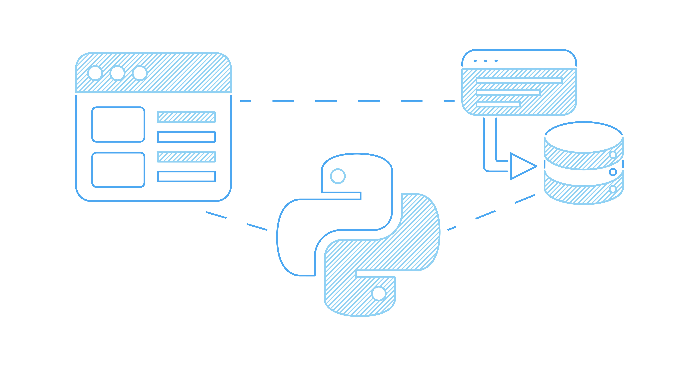
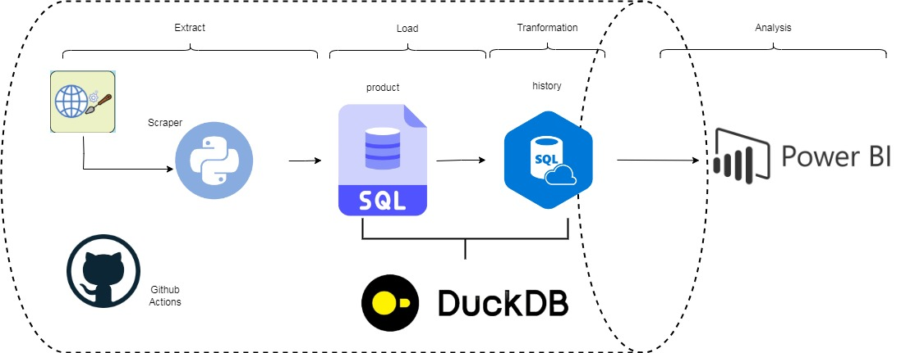
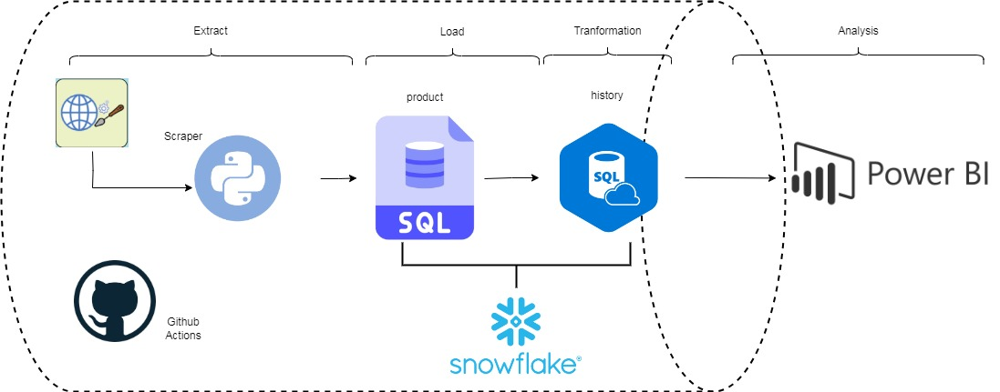

# **Proyecto Price Tracker 💸**

## Contexto 📈
En algunas ocasiones es dificil encontrar la mejor oferta y tener la certeza de que lo que estamos comprando esta al mejor precio. Muchas veces el querer saber el historial de precion de algunas plataformas conlleva el pagar por esta informacion. Lo ideal seria generar nuestra propia informacion y asi poder saber con certeza que estamos encontrando una verdadera ofera que vale la pena. Sin emgargo, muchas veces las mejores ofertas en precios suceden en un lapso de tiempo que puede ser horas. Por lo cual tener la informacion mas actual se vuelve vital.

## Objetivo 💢
Se utilizara un webscraping para poder obtener la informacion de precios de un producto, el resultado se alamcenara en una tabla de SQL la cual servira para llevar un rastreo de precio por dia. Adicionalmente se tendra una tabla historica conectada a un tablero para poder visualizar la informacion

## Descripcion del fujo 🖥️
El flujo actual de prototipo consiste de las siguientes partes:

* **Extracción:**

Esta etapa consiste en el webscraping de la página de Amazon, por el cual extraeremos el precio del producto de interés. Para esto se hará con el script de Python llamado extract.py. El cual está basado en el paquete de scrapy para poder realizar el webscraping de la página. En este punto se eligió esta opción debido a que existen API que nos pueden dar estar información. Sin embargo, estas conllevan un pago lo cual no se ajusta al prototipo de este proyecto. En una futura versión el conectarse a una API sería una mejor opción ya que simplifica el proceso y nos permite acceder a más información histórica, no solo a la información del día.

* **Transformación:**

La información generada del webscraping se cargará en una tabla transición de SQL, en este primer prototipo se manejara una base de datos local en duckDB. En la cual, se ingestara información a lo largo del día, se tiene planeado que esta ingesta de información se realice tres veces al día para el prototipo. Con esta información se generaría una tabla que almacene la información al día para que de esta forma se puede determinar cuándo un precio de un producto es más bajo a lo largo del día.
Una mejor opción que es más sostenible y que se planea en otra versión es tener esta información ingestandose de manera más continua en intervalos de 1 hora en una tabla de Snowflake ya que nos ayudaría a tener información más actual y tener mejor perspectiva de los precios del producto.

* **Carga:**

Una segunda transformación se llevará a cabo sobre la tabla anterior generando una tabla histórica del precio del producto. Esto se realizará antes de que acabe el día y después de la última corrida de ingesta de la primera tabla. Para evitar valores duplicados se ingestara únicamente el valor mínimo de los valores de la tabla transición, o la primera tabla. Esta tabla histórica servirá para poder conectar un visualizador para que sea más fácil el observar y apreciar tendencias en los precios del producto
Una aplicación para una segunda versión es tener tanto la primera tabla de ingesta como la tabla de histórico en Snowflake, de esta forma se puede programar un Store Procedure que al final del día pueda generar un resumen del precio mínimo del producto al día, al igual que la clasificación de comentarios de este. De igual forma, es más fácil conectar un visualizador a Snowflake para poder mostrar la información del comportamiento del producto.

* **Alertas:**

La finalidad de este proyecto no es solo generar datos para tener un rastreo de los precios de un producto. Si no, también generar una alerta para poder comprar este cuando alcance los valores más bajos. Para esto es necesario generar un medio de alerta que nos avise en qué momento un producto ha bajado más su precio. La forma de generar esta la alerta será ocupando los datos históricos del producto.

## Diagrama del pipeline
El siguiente es el diagrama actual que se tiene para el prototipo funcional del price tracker, el cual puede correr localmente y utiliza Duckdb como motor de base de datos y Github actions como orchestador del pipeline. Para que finalmente se generen dos tablas la de products, la cual guardara toda la informacion extraida por medio del webscraping. Para posteriormente, hacer una tabla historico con los precios mas bajos encontrados por dia.

El segundo diagrama es para una segunda version para utilizar un data lake en este caso Snowflake para poder administrar todo. Con esto en lugar de guadar la informacion de manera local en un archivo de duckdb, se enviara la informacion directamente a Snowflake para posteriormente conectar un visualizar comon power bi para poder visualizar los datos. Todo esto se llevara a cabo por medio de github actions como orchestador.

## Futuras versiones

Como futuras entregas a parte de aplicar lo del diagrama dos del prototipo, es decir utilizando Snowflake en lugar de duckdb. Se tiene pensado aplicar alertas en el proceso del pipeline por medio de un script de python. Este correra una vez ingestada la informacion en la base de datos. Con esto se puede generar un mensaje de alerta para notificar cuando el precio del articulo haya alcanzado un minimo o por abajo de un minimo de precio fijado.

## 🔗 Link importantes 🔗
1. [Link a la pagina de extraccion](https://www.amazon.com.mx/s?k=samsung+a54+desbloquedo&rh=n%3A9687460011&__mk_es_MX=%C3%85M%C3%85%C5%BD%C3%95%C3%91&ref=nb_sb_noss)
2. [Base da datos Duckdb](../scripts/products_base.duckdb)
3. [Archivo con la descripcion del proyecto](../doc/proyecto.md)
4. [PDF presentación del proyecto]()

